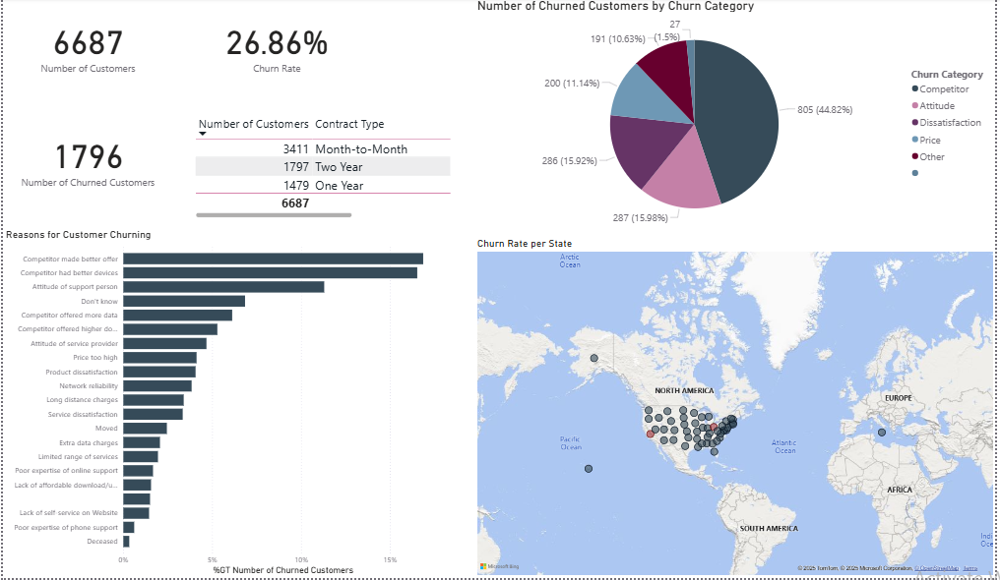
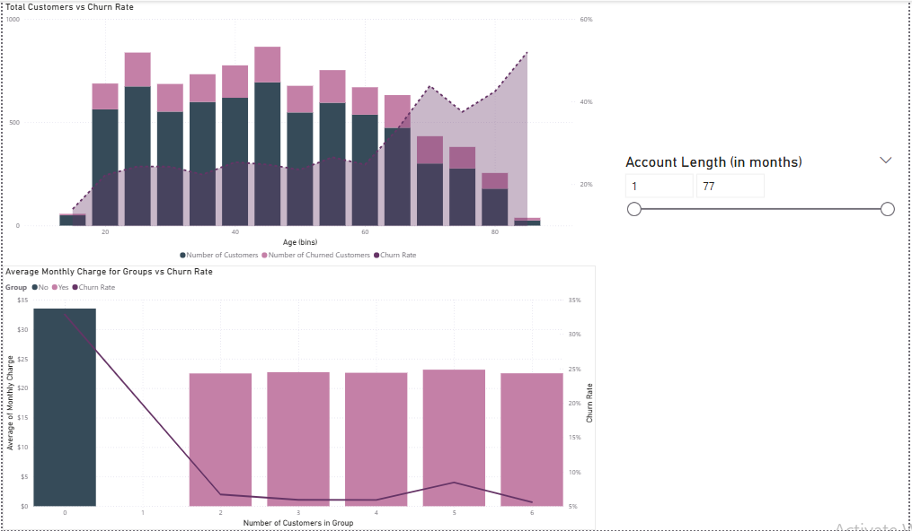
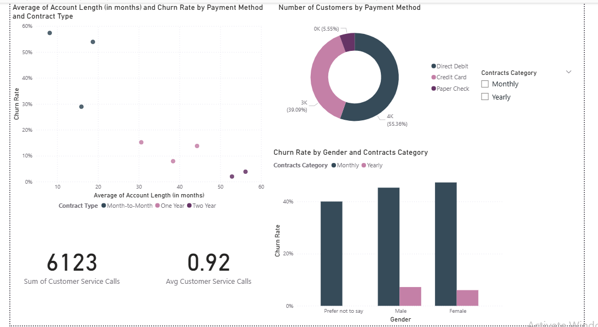
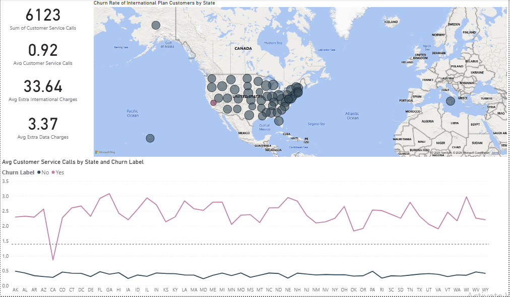

# Databel-Churn-Analysis-Report

## Project Overview
This project analyses customer churn for Databel, a telecommunications company, to identify why customers leave and which factors drive attrition. The outcome is an interactive Power BI dashboard that allows decision-makers to explore churn trends, uncover high-risk segments, and design targeted retention strategies.

## Objectives
* Measure customer churn rates across key demographics and service categories.
* Identify major drivers of churn, such as contract type, tenure, and payment method.
* Provide actionable insights through **DAX-powered KPIs** and visualisations.
* Enable Databel to monitor churn trends and track the impact of retention initiatives.

## Tools & Skills Applied
* **Power BI Desktop** → Data modeling, dashboard design
* **Power Query** → Data cleaning and transformation
* **DAX (Data Analysis Expressions)** → Advanced calculations (e.g., churn rate, tenure-based measures, risk segmentation)
* **Data Visualisation** → Interactive charts, slicers, KPIs, and drill-through pages

## Key Insights
* Customers on **month-to-month contracts** were significantly more likely to churn compared to long-term contracts.
* **Electronic check payment users** had a higher churn rate, suggesting pain points in the billing experience.
* Customers with **short tenure (<12 months)** showed the highest churn risk.
* Value-added services (e.g., multiple lines, premium internet plans) reduced churn likelihood when bundled effectively.

## Dashboard Features
* **Churn Overview:** Total churn %, at-risk customers, and trend lines over time.
* **Customer Segmentation:** Churn by demographics, contract type, and service features.
* **Driver Analysis:** Key attributes influencing churn, with drill-through for deeper analysis.
* **Retention Strategy View:** Segments that need targeted offers or interventions.

## Screenshots

## How to Use
1. Download the `.pbix` file from this repository.
2. Open it in **Power BI Desktop** (free to download from Microsoft).
3. Interact with the visuals using filters, slicers, and drill-throughs.
